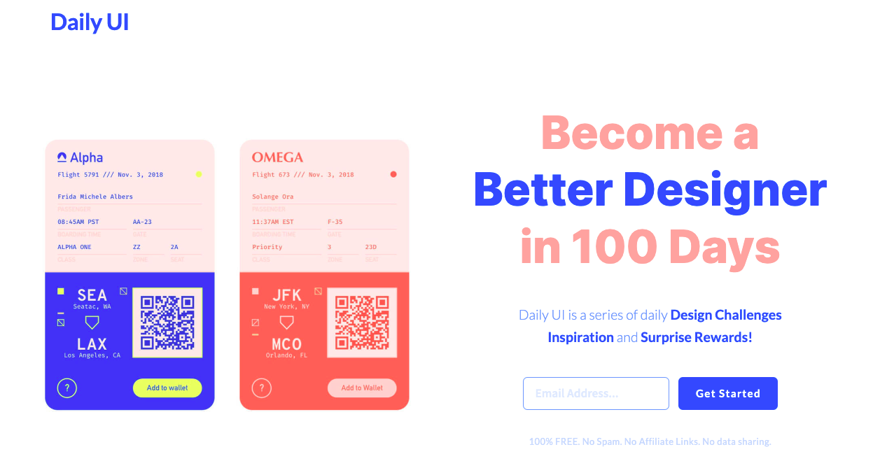

# DailyUI
A collection of daily frontend projects. 1 challenge completed every 1-2 days. Each folder contains a README as well as link to view the project. All projects can be viewed here https://www.playbook.com/frontend/Pmjk1PSPWTB5MG3emgW4EQ6H

Challenges provided by https://www.dailyui.co/

## How It's Made
Tech: HTML, CSS, Tailwind CSS, BootStrap

Everyday, I code these challenges to stay relevant and up-to-date with my frontend knowledge

## Optimizations
My initial creations are made with pure HTML and CSS. Further iterations are made using Tailwind and Bootstrap to stay relevant with modern coding practices

## Lesson I Learned
First impressions are imporatant, especially when dealing with end-users. Being able to navigate the Frontend and Backend makes me a better Full-Stack Developer and provides greater value to my end users